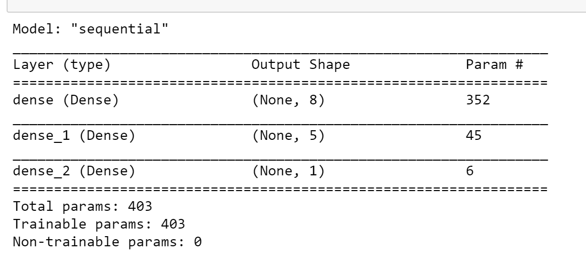
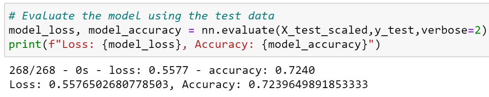
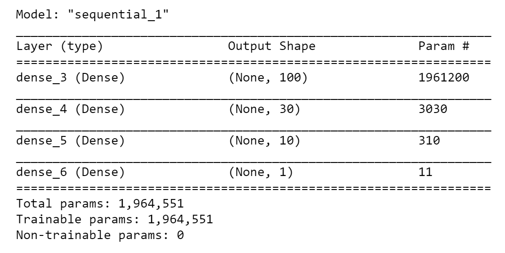
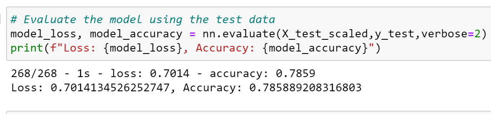

# Module 19 Challenge - Neural_Network_Charity_Analysis

# Overview of the analysis

The objective is to build a neural network model along with machine learning that will accurately predict investments for the non-profit Alphabet Soup foundation that provides funding to various organizations. The complicated analysis will need to use a Deep Learning Neural Network model to interpret which organizations are worth donating to versus those which are high risk.

Tools used will be Python TensorFlow library, Pandas / Jupyter Notebook to model, fit, predict and transform the data.

The dataset contains the following organizational features to be used in the initial analysis: 
EIN
NAME
APPLICATION_TYPE
AFFILIATION
CLASSIFICATION
USE_CASE
ORGANIZATION
STATUS
INCOME_AMT
SPECIAL_CONSIDERATIONS
ASK_AMT
IS_SUCCESSFUL

# Results

Training was done using two models. 
- The 1st model used two layers, 1st layer=8, hidden layer=5.
- Once trained, the 1st model accuracy was as follows: 

- The 2nd model was optimized and trained.
- The 2nd model used three layers, 1st layer=100, 2nd hidden layer=30, 3rd hidden layer=10.

# Data Preprocessing

## What variable(s) are considered the target(s) for your model?

- Target/dependent variable is IS_SUCCESSFUL

## What variable(s) are considered to be the features for your model?

- Features included: APPLICATION_TYPE,AFFILIATION,CLASSIFICATION,USE_CASE,ORGANIZATION,STATUS,INCOME_AMT,SPECIAL_CONSIDERATIONS,ASK_AMT,IS_SUCCESSFUL.

## What variable(s) are neither targets nor features, and should be removed from the input data?

- Variables that were initially removed was EIN and NAME
- Variables CLASSIFICATION and APPLICATION_TYPE were binned together
- The originals CLASSIFCATION and APPLICATION_TYP were dropped and the OneHotEncoded features used instead.
- Categorical variables were transformed using OneHotEncoder

# Compiling, Training, and Evaluating the Model

## How many neurons, layers, and activation functions did you select for your neural network model, and why?

Eventually after adding a 3rd hidden layer, modified the neuron for all 3 layers as well and epochs and found the epochs had minimal affect below 100. Relu and Sigmoid activation functions used and performed the best with Sigmoid as 2nd & 3rd layers. 

## Were you able to achieve the target model performance?

Yes. Once NAME was added back, the accuracy was over 78%.

## What steps did you take to try and increase model performance?

Initially started with changing the epochs. The lower the epochs, the lower the accuracy. Epochs increased until reached 100 when accuracy wasn't improving. Moved to changing Keras model layers 1 and 2, finding that layer 1 has the most impact on accuracy. Added a 3rd layer which improved accuracy 1%. Modifying neurons for hidden layer 2 had less impact with hidden layer 3 having an lesser impact than 2.

# Summary: 

## Summarize the overall results of the deep learning model.Include a recommendation for how a different model could solve this classification problem, and explain your recommendation.

The model performed better with three layers, 100 epochs and higher values for hidden layers 2 & 3. The Sigmoid activation performed better than Relu.

The model improved accuracy once NAME feature was added back into the dataset. Recommend checking features like CLASSIFICATION, APPLICATION_TYPE and STATUS'to determine if they should be dropped (as extra noise) to improve accuracy. Attempt using Sigmoid for all or explore a different layer sequence using Relu/Sigmoid which may or may not improve accuracy.